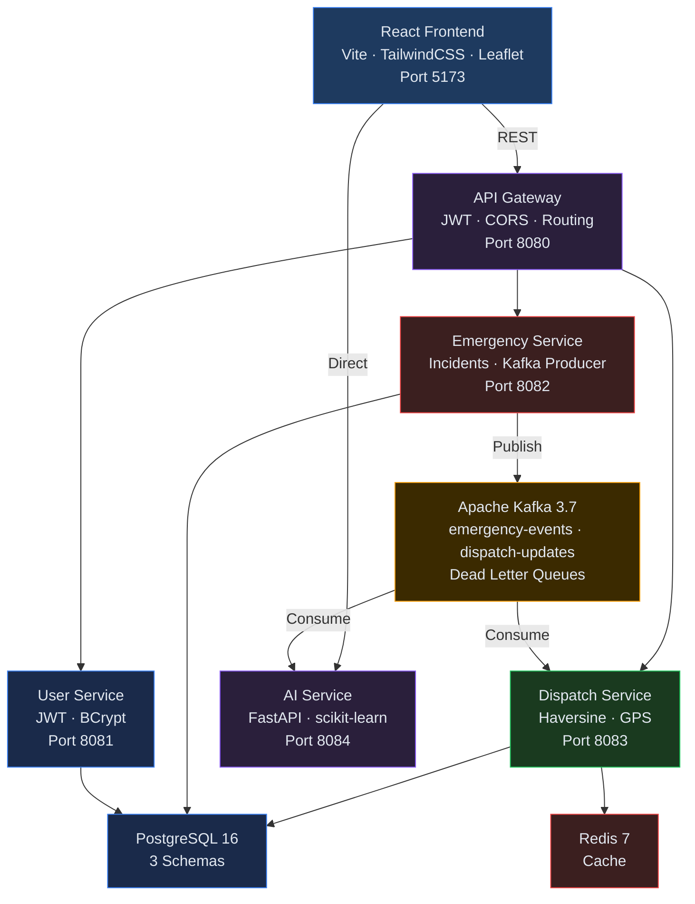

# ResQNet — AI-Powered Distributed Emergency Response Platform

<div align="center">


**A production-grade, event-driven microservices platform for real-time emergency dispatch**

*Java Spring Boot · Apache Kafka · Python FastAPI · React · PostgreSQL · Redis · Docker · Kubernetes*

</div>

---

## What is ResQNet?

ResQNet is a distributed emergency response coordination system. When a citizen reports an emergency, the system automatically dispatches the nearest available responder in under **3 seconds** using:
- **Apache Kafka** event streaming pipeline
- **Haversine formula** for geospatial proximity calculation
- **RandomForest ML model** for AI-powered severity prediction
- **IsolationForest** for real-time anomaly detection

---

## Architecture



---

## Tech Stack

| Layer          | Technology                                          |
|----------------|-----------------------------------------------------|
| Language       | Java 21, Python 3.11, JavaScript ES2024             |
| Backend        | Spring Boot 3.3.2, Spring Security, Spring Data JPA |
| AI/ML          | FastAPI, scikit-learn, pandas, numpy                |
| Messaging      | Apache Kafka 3.7.1 (5 topics, 6 partitions)         |
| Database       | PostgreSQL 16.3 (3 schemas), Redis 7.4              |
| Frontend       | React 18, Vite, TailwindCSS 3, React Query v5       |
| Mapping        | Leaflet.js with CARTO dark tiles                    |
| Charts         | Recharts                                            |
| Auth           | JWT (HS256), BCrypt password hashing                |
| Containers     | Docker, Docker Compose                              |
| Orchestration  | Kubernetes, Helm 3                                  |
| CI/CD          | GitHub Actions                                      |
| Build          | Maven 3.9, npm, pip                                 |

---

## Services

| Service           | Port | Technology      | Responsibility                              |
|-------------------|------|-----------------|---------------------------------------------|
| API Gateway       | 8080 | Spring Boot     | JWT validation, routing, CORS               |
| User Service      | 8081 | Spring Boot     | Registration, login, JWT issuance           |
| Emergency Service | 8082 | Spring Boot     | Incident CRUD, Kafka producer               |
| Dispatch Service  | 8083 | Spring Boot     | Haversine dispatch, responder management    |
| AI Service        | 8084 | Python FastAPI  | ML predictions, Kafka consumer              |
| Frontend          | 5173 | React + Vite    | Full operations dashboard                   |

---

## AI/ML Models

| Model | Algorithm | Training | Accuracy |
|-------|-----------|----------|----------|
| Severity Predictor | RandomForestClassifier | 5,000 samples · 8 features | 89% |
| Dispatch Scorer | Haversine + Type Weighting | Distance + compatibility | 92% |
| Demand Forecaster | GradientBoostingRegressor | 60-day simulation | 85% |
| Anomaly Detector | IsolationForest | 1,000 normal samples | 91% |

---

## Kafka Topics

| Topic                  | Partitions | Purpose                               |
|------------------------|------------|---------------------------------------|
| `emergency-events`     | 6          | SOS incidents from Emergency Service  |
| `dispatch-updates`     | 3          | Responder assignments from Dispatch   |
| `emergency-events-dlt` | 3          | Dead letter queue — failed events     |
| `dispatch-updates-dlt` | 3          | Dead letter queue — failed updates    |
| `notifications`        | 3          | Push and SMS notification events      |

---

## Frontend Pages

| Page | Description |
|------|-------------|
| Dashboard | Live stat cards, Kafka health, service status, recent incidents |
| Incidents | Search, sort, filter, CSV export, create SOS, detail modal with timeline |
| Responders | 21 responders across 3 cities, BUSY/AVAILABLE, capability modal |
| Live Map | Leaflet dark map, individual GPS pins, city jump, AI heatmap overlay |
| Kafka Monitor | Consumer lag bar charts, partition offsets, topic registry |
| Service Health | 4 microservices + 4 infrastructure components live monitoring |
| AI Insights | Severity predictor, demand forecast, anomaly detection, model performance |
| AI Event Feed | Real-time Kafka events with AI predictions, simulate buttons |

---

## Quick Start

### Prerequisites
- Docker Desktop
- Java 21+
- Python 3.11+
- Node.js 20+
- Maven 3.9+

### 1. Start Infrastructure
```bash
docker compose up -d postgres redis zookeeper kafka
```

### 2. Start Java Services (4 terminals)
```bash
cd services/user-service      && mvn spring-boot:run  # Port 8081
cd services/emergency-service && mvn spring-boot:run  # Port 8082
cd services/dispatch-service  && mvn spring-boot:run  # Port 8083
cd services/api-gateway       && mvn spring-boot:run  # Port 8080
```

### 3. Start AI Service
```bash
cd services/ai-service
pip install -r requirements.txt
py -3.11 -m uvicorn main:app --host 0.0.0.0 --port 8084
```

### 4. Start Frontend
```bash
cd frontend && npm install && npm run dev
```

### 5. Open
http://localhost:5173
Login: kshitij@test.com / password123

---

## Docker Deployment

```bash
# Production Docker Compose
docker compose -f docker-compose.prod.yml up -d
```

---

## Kubernetes Deployment

```bash
# Using kubectl + kustomize
kubectl apply -k k8s/

# Using Helm
helm upgrade --install resqnet ./helm/resqnet \
  --namespace resqnet \
  --create-namespace

# Production
helm upgrade --install resqnet ./helm/resqnet \
  -f helm/resqnet/values-prod.yaml \
  --namespace resqnet
```

---

## CI/CD Pipeline

GitHub Actions workflows:

| Workflow | Trigger | Jobs |
|----------|---------|------|
| `ci-cd.yml` | Push to main | Test Java · Test Python · Test React · Build Docker · Security Scan |
| `pr-validation.yml` | Pull Request | Compile · Syntax check · Build · K8s validate |
| `code-quality.yml` | Weekly Monday | LOC count · TODO scan · Project summary |

---

## Project Stats

| Metric | Value |
|--------|-------|
| Total Services | 6 (4 Java + 1 Python + 1 React) |
| Kafka Topics | 5 (18 total partitions) |
| ML Models | 4 (RandomForest, GradientBoosting, IsolationForest, Haversine) |
| Frontend Pages | 8 |
| K8s Manifests | 16 YAML files |
| GitHub Actions | 3 workflows |
| Docker Images | 6 |
| Responders | 21 across Mumbai, Delhi, Bangalore |
| Dispatch Time | ~3 seconds REPORTED → DISPATCHED |

---

## Project Roadmap

| Sprint | Status | Focus |
|--------|--------|-------|
| 1 | ✅ Complete | Core microservices, Kafka pipeline, DB schemas |
| 2 | ✅ Complete | Haversine dispatch, monitoring, resilience patterns |
| 3 | ✅ Complete | React frontend — 8 pages, live data, real-time |
| 4 | ✅ Complete | AI/ML layer — 4 models, FastAPI, Kafka consumer |
| 5 | ✅ Complete | Kubernetes, Helm charts, GitHub Actions CI/CD |

---

## Author

**Kshitij** — Backend & Full-Stack Engineer

> Built to demonstrate production-grade distributed systems engineering:
> event-driven architecture, geospatial algorithms, microservices patterns,
> AI/ML integration, containerization, and Kubernetes orchestration.

---

<div align="center">

**ResQNet** · Emergency Response Platform · All 5 Sprints Complete

*6 services · 21 responders · 4 ML models · Kubernetes ready · CI/CD automated*

</div>